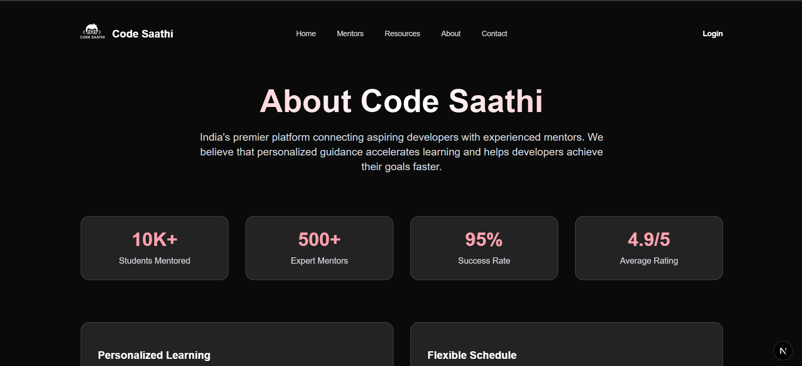

# Code Saathi

> **This repository is my submission for the Web Development Competition.**
>
> Welcome, judges and reviewers! This project demonstrates a modern, responsive, and interactive web platform for connecting learners with coding mentors and resources. All data is dummy and can be easily edited for future use.

---

## 📝 Submission Notes
- **Participant:** Zaid Ahmed Ansari
- **Competition:** Web Dev Quiz Showdown by Code Saathi
- All code, UI, and features were built as part of this competition entry.

---

## 🚀 Overview
Code Saathi helps aspiring developers connect with experienced mentors, discover curated resources, and grow their coding skills. The project demonstrates best practices in component modularization, search, sorting, pagination, and modern UI/UX.

---

## ✨ Features
- **Homepage**: Animated hero section, intro, and call-to-action.
- **Mentors Page**: Browse mentor profiles with search, multi-sorting, and pagination.
- **Resources Page**: Curated coding resources with search and pagination.
- **About & Contact Pages**: Platform info and a contact form.
- **Responsive Design**: Mobile-first, glassmorphism, and accessible.
- **Animations**: Framer Motion for smooth transitions.
- **Navbar & Footer**: Translucent, modern, and consistent across pages.
- **Toast Notifications**: User feedback for actions (e.g., copying links).

---

## 📸 Screenshots

### Homepage


### Mentors Page


### Resources Page


### About Page


### Contact Page


---

## ⚡ Quick Start

Clone the repository and run the project locally:

```bash
git clone https://github.com/Zaid-Ahmed-Ansari/Code-Saathi.git
cd code-sathi
npm install
npm run dev
```

Then open [http://localhost:3000](http://localhost:3000) in your browser.

---

## 🗂️ Project Structure
- `app/` — Next.js App Router pages
  - `page.js` — Homepage
  - `mentors/page.js` — Mentors listing
  - `resources/page.js` — Resources listing
  - `about/page.js` — About Us
  - `contact/page.js` — Contact form
  - `layout.js` — Global layout, Navbar, Footer
- `components/` — Reusable UI components
  - `ui/` — Navbar, Footer, SearchBar, SocialButton, etc.
  - `MovingMentors.js`, `background-paths.jsx` — Homepage hero/testimonials
- `public/` — Static assets (images, icons)

---

## 📝 Editing Data
All mentor profiles and resources use **dummy data** for demonstration. You can:
- Edit the arrays in `app/mentors/page.js` and `app/resources/page.js` to update or add new mentors/resources.
- Update Mentors List in `components/MovingMentors.js`.
- Replace images in the `public/` folder or update URLs in the data arrays.

This makes the project easy to adapt for real data or future use cases.

---

## 🛠️ Running Locally
1. **Install dependencies:**
   ```bash
   npm install
   # or
yarn install
   ```
2. **Start the development server:**
   ```bash
   npm run dev
   # or
yarn dev
   ```
3. **Open your browser:**
   Visit [http://localhost:3000](http://localhost:3000)

---

## 🧩 Tech Stack
- [Next.js](https://nextjs.org/) (App Router)
- [React](https://react.dev/)
- [Tailwind CSS](https://tailwindcss.com/)
- [Framer Motion](https://www.framer.com/motion/)
- [Fuse.js](https://fusejs.io/) (fuzzy search)
- [shadcn/ui](https://ui.shadcn.com/) (UI primitives)
- [sonner](https://sonner.emilkowal.ski/) (toast notifications)

---

## 🛠️ Customization
- **Add new mentors/resources:** Edit the respective arrays in the page files.
- **Change branding/colors:** Update Tailwind config and component classes.
- **Replace images:** Add to `public/` and update references in data.
- **Extend features:** Add new pages/components as needed.

---

## 📄 License
This project is the submission for the Web Dev Quiz Showdown by Code Saathi by Zaid Ahmed Ansari.
